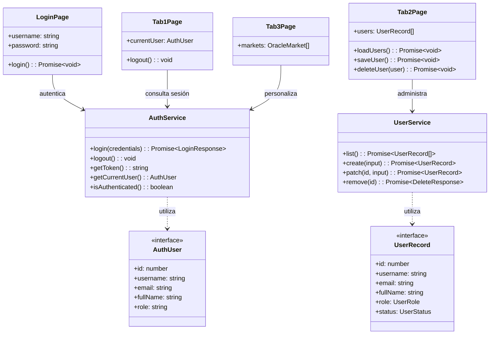

# Diagrama sencillo de clases

El siguiente diagrama representa las clases e interfaces principales implementadas en la aplicación. Las páginas consumen servicios; los servicios envían las solicitudes HTTP a la API PHP y transforman las respuestas en interfaces TypeScript.

## Responsabilidades

- `AuthService`: realiza el inicio de sesión, persiste el token y controla el estado de autenticación.
- `UserService`: encapsula las llamadas Axios al endpoint `users.php`.
- `Tab2Page`: administra el estado del formulario y presenta las operaciones CRUD.
- `AuthUser` y `UserRecord`: establecen contratos tipados entre la interfaz, los servicios y la API.

