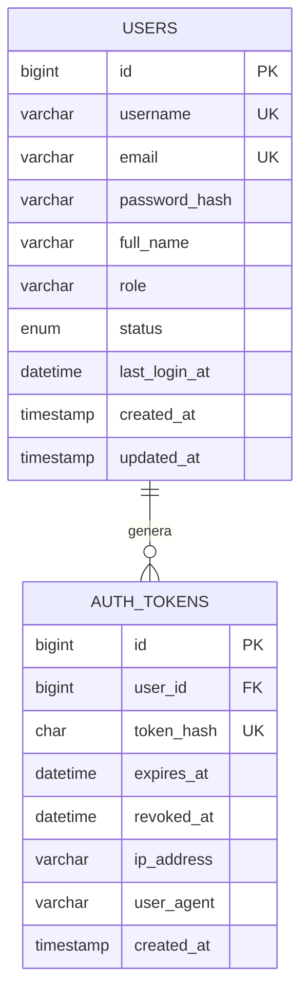

# Modelo inicial de datos

La primera etapa del Oráculo MLB usa dos entidades: usuarios y tokens de autenticación. La estructura física se encuentra en `backend/php-api/database.sql`.

## Entidad `users`

Almacena las cuentas que pueden entrar a la aplicación.

| Campo | Uso |
|---|---|
| `id` | Identificador interno |
| `username` | Nombre único utilizado para iniciar sesión |
| `email` | Correo único; también puede utilizarse para iniciar sesión |
| `password_hash` | Contraseña cifrada mediante `password_hash()` |
| `full_name` | Nombre mostrado en la aplicación |
| `role` | `admin` o `user` |
| `status` | `active`, `inactive` o `blocked` |
| `last_login_at` | Fecha del último acceso correcto |
| `created_at`, `updated_at` | Auditoría básica |

## Entidad `auth_tokens`

Registra las sesiones creadas al iniciar sesión. En la base únicamente se almacena el SHA-256 del token; el valor original se entrega al cliente una sola vez.

La relación es **uno a muchos**: un usuario puede tener varias sesiones. La llave foránea tiene `ON DELETE CASCADE`, por lo que al eliminar un usuario también se eliminan sus tokens.

## Siguiente ampliación

Cuando se conecte el modelo predictivo se agregarán entidades para juegos, abridores, predicciones y resultados. Esa ampliación debe realizarse junto con el contrato definitivo de la API Python para no duplicar los datos que ya produce el pipeline MLB.

